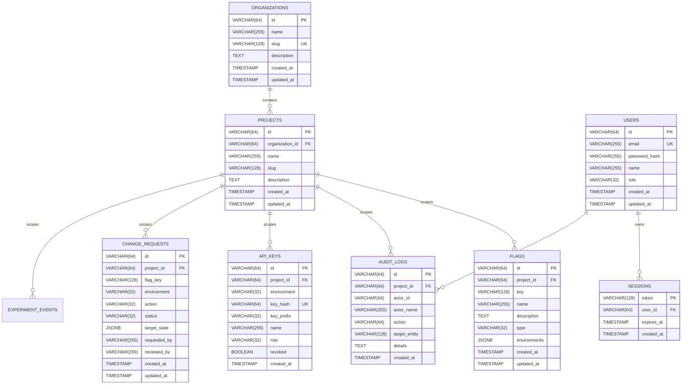

# 💾 Data Models & Storage Architecture

This document details Flagura's relational schema design, JSONB configuration modeling, connection pooling strategies, and storage abstraction patterns.

---

## ⚡ The Dual-Plane Storage Architecture

> **"Persisted in PostgreSQL. Evaluated in CPU Cache."**

Flagura strictly decouples **Control Plane state persistence** from **Data Plane runtime evaluation**:

| Layer                 | Responsibility                                                                                | Storage Medium                                                    | Latency Profile                |
| --------------------- | --------------------------------------------------------------------------------------------- | ----------------------------------------------------------------- | ------------------------------ |
| **Control Plane**     | Flag management, 4-Eyes change requests, user RBAC, project API keys, immutable audit logging | **Durable Relational ACID Store** (PostgreSQL or Embedded SQLite) | `1ms – 5ms` write latency      |
| **Edge Distribution** | Real-time rule synchronization across distributed nodes                                       | **Persistent Server-Sent Events (SSE)**                           | `<5ms` propagation             |
| **Data Plane (SDK)**  | High-throughput request evaluation on critical user paths                                     | **In-Process RAM + Local Disk Snapshot**                          | **`~85ns`** (zero network I/O) |

### Why In-Process Evaluation Requires Durable Persistence

1. **Zero Database Meltdown**: At 50,000 requests/sec across microservices, direct database queries would crash relational connection pools. Local in-memory caching isolates traffic surges completely from the database.
2. **Cold-Start Resilience**: The SDK writes encrypted rule snapshots to the local file system. If an application restarts while the network or database is temporarily unreachable, it boots instantly from the local disk cache with zero downtime.
3. **Auditability & Governance**: Every toggle, change request approval, and rollout modification is committed transactionally with foreign key integrity and point-in-time recovery.

---

## 🗄️ Entity-Relationship Diagram (ERD)



---

## 📦 JSONB Environment Configuration Modeling

Rather than creating separate rows and foreign-key joins for every environment and targeting rule, Flagura stores per-environment configurations inside a high-speed **`JSONB` column**:

```json
{
  "production": {
    "enabled": true,
    "strategy": "percentage",
    "percentage": 50,
    "rules": [
      {
        "id": "rule_staff",
        "name": "Staff Whitelist",
        "attribute": "email",
        "operator": "ends_with",
        "values": ["@flagura.dev"],
        "serve_variant": "treatment",
        "enabled": true
      }
    ],
    "variants": []
  },
  "staging": {
    "enabled": true,
    "strategy": "boolean"
  },
  "development": {
    "enabled": true,
    "strategy": "boolean"
  }
}
```

### Architectural Benefits:

1. **Zero-Migration Schema Extensibility**: New rollout strategies, targeting operators, or metadata attributes can be added without running relational database migrations (`ALTER TABLE`).
2. **Atomic Single-Row Updates**: All environments and rules for a feature flag are committed in a single atomic row transaction.
3. **GIN Indexable**: Enables lightning-fast indexing via PostgreSQL JSONB GIN indexes (`CREATE INDEX idx_flags_env ON flags USING gin (environments);`).

---

## ⚡ Connection Pooling & Database Sizing

Flagura is optimized for **Transaction Connection Poolers** (e.g. Supabase Port 6543 / pgBouncer / AWS RDS Proxy):

```go
db.SetMaxOpenConns(25)                  // Limits active connections to pooler
db.SetMaxIdleConns(25)                  // Keeps warm connections ready
db.SetConnMaxLifetime(15 * time.Minute) // Periodically cycles stale pooler sockets
db.SetConnMaxIdleTime(5 * time.Minute)  // Reclaims idle connections
```

| Environment        | Database Host                        |  Port  | SSL Mode  | Notes                                           |
| :----------------- | :----------------------------------- | :----: | :-------: | :---------------------------------------------- |
| **Supabase Cloud** | `aws-0-[region].pooler.supabase.com` | `6543` | `require` | Transaction Pooler mode (IPv4 & IPv6 supported) |
| **Neon / RDS**     | `ep-[name].[region].neon.tech`       | `5432` | `require` | Direct / Proxy connection                       |
| **Local Docker**   | `localhost` or `postgres`            | `5432` | `disable` | Local container network                         |

---

## 🛡️ Store Interface Abstraction

The persistence layer adheres to the clean **Go `Store` interface** in [`pkg/store/store.go`](file:///Users/dhawal.dyavanpalli/go/src/flagura/pkg/store/store.go):

```go
type Store interface {
    // Multi-Tenancy
    CreateOrganization(ctx context.Context, org domain.Organization) (*domain.Organization, error)
    CreateProject(ctx context.Context, project domain.Project) (*domain.Project, error)
    ListProjects(ctx context.Context, organizationID string) ([]domain.Project, error)

    // Project-Scoped Flags & Audit
    ListFlagsByProject(ctx context.Context, projectID string) ([]domain.FeatureFlag, error)
    GetFlagByProject(ctx context.Context, projectID, keyOrID string) (*domain.FeatureFlag, error)
    SaveFlag(ctx context.Context, flag domain.FeatureFlag, actor string) (*domain.AuditLogEntry, error)
    DeleteFlag(ctx context.Context, keyOrID string, actor string) (*domain.AuditLogEntry, error)
    ToggleFlag(ctx context.Context, keyOrID string, env domain.Environment, enabled *bool, actor string) (*domain.FeatureFlag, *domain.AuditLogEntry, error)

    // Health Check & Driver
    Ping(ctx context.Context) error
    DriverName() string
}
```

---

## 🔌 Supported Storage Engines

Flagura ships with 3 pluggable storage drivers implementing `store.Store`:

| Driver | Implementation | Best For | Activation |
|---|---|---|---|
| **Embedded SQLite** | [`SQLiteStore`](file:///Users/dhawal.dyavanpalli/go/src/flagura/pkg/store/sqlite.go) | Single-binary self-hosting, lightweight VPS, Raspberry Pi, durable single-node | `DATABASE_URL=sqlite://data/flagura.db` or ends with `.db` |
| **PostgreSQL** | [`PostgresStore`](file:///Users/dhawal.dyavanpalli/go/src/flagura/pkg/store/postgres.go) | Distributed HA production, Supabase, Neon, AWS Aurora/RDS | `DATABASE_URL=postgres://...` |
| **In-Memory Edge Store** | [`MemoryStore`](file:///Users/dhawal.dyavanpalli/go/src/flagura/pkg/store/memory.go) | Zero-dependency local developer trials, unit testing, instant sandbox | Default when `DATABASE_URL` is empty |

### SQLite Engine Specifics
- **Pure Go Driver (`modernc.org/sqlite`)**: Requires zero CGo (`CGO_ENABLED=0`), maintaining effortless cross-compilation across Linux, macOS, and Windows.
- **WAL Mode (`PRAGMA journal_mode = WAL;`)**: Allows concurrent reads while writes are occurring without database locks.
- **Auto-Migrations & Seeding**: Idempotently creates tables on startup and seeds default workspace organizations and demo flags if empty.
