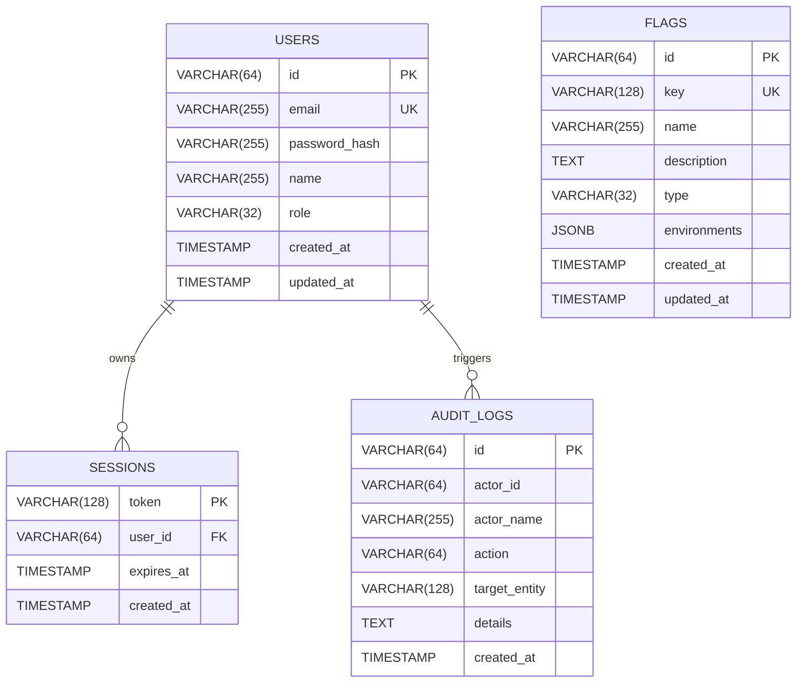

# 💾 Data Models & Storage Architecture

This document details Flagura's relational schema design, JSONB configuration modeling, connection pooling strategies, and storage abstraction patterns.

---

## 🗄️ Entity-Relationship Diagram (ERD)



---

## 📦 JSONB Environment Configuration Modeling

Rather than creating separate rows and foreign-key joins for every environment and targeting rule, Flagura stores per-environment configurations inside a high-speed **`JSONB` column**:

```json
{
  "production": {
    "enabled": true,
    "strategy": "percentage",
    "percentage": 50,
    "rules": [
      {
        "id": "rule_staff",
        "name": "Staff Whitelist",
        "attribute": "email",
        "operator": "ends_with",
        "values": ["@flagura.dev"],
        "serve_variant": "treatment",
        "enabled": true
      }
    ],
    "variants": []
  },
  "staging": {
    "enabled": true,
    "strategy": "boolean"
  },
  "development": {
    "enabled": true,
    "strategy": "boolean"
  }
}
```

### Architectural Benefits:
1. **Zero-Migration Schema Extensibility**: New rollout strategies, targeting operators, or metadata attributes can be added without running relational database migrations (`ALTER TABLE`).
2. **Atomic Single-Row Updates**: All environments and rules for a feature flag are committed in a single atomic row transaction.
3. **GIN Indexable**: Enables lightning-fast indexing via PostgreSQL JSONB GIN indexes (`CREATE INDEX idx_flags_env ON flags USING gin (environments);`).

---

## ⚡ Connection Pooling & Database Sizing

Flagura is optimized for **Transaction Connection Poolers** (e.g. Supabase Port 6543 / pgBouncer / AWS RDS Proxy):

```go
db.SetMaxOpenConns(25)                  // Limits active connections to pooler
db.SetMaxIdleConns(10)                  // Keeps warm connections ready
db.SetConnMaxLifetime(10 * time.Minute) // Periodically cycles stale pooler sockets
db.SetConnMaxIdleTime(3 * time.Minute)  // Reclaims idle connections
```

| Environment | Database Host | Port | SSL Mode | Notes |
| :--- | :--- | :---: | :---: | :--- |
| **Supabase Cloud** | `aws-0-[region].pooler.supabase.com` | `6543` | `require` | Transaction Pooler mode (IPv4 & IPv6 supported) |
| **Neon / RDS** | `ep-[name].[region].neon.tech` | `5432` | `require` | Direct / Proxy connection |
| **Local Docker** | `localhost` or `postgres` | `5432` | `disable` | Local container network |

---

## 🛡️ Store Interface Abstraction

The persistence layer adheres to the clean **Go `Store` interface** in [`pkg/store/store.go`](file:///Users/dhawal.dyavanpalli/go/src/flagura/pkg/store/store.go):

```go
type Store interface {
    GetFlag(ctx context.Context, key string) (domain.FeatureFlag, error)
    ListFlags(ctx context.Context) ([]domain.FeatureFlag, error)
    CreateFlag(ctx context.Context, flag domain.FeatureFlag) error
    UpdateFlag(ctx context.Context, flag domain.FeatureFlag) error
    DeleteFlag(ctx context.Context, key string) error
    
    GetUserByEmail(ctx context.Context, email string) (domain.User, error)
    CreateUser(ctx context.Context, user domain.User) (domain.User, error)
    
    GetSession(ctx context.Context, token string) (domain.Session, error)
    CreateSession(ctx context.Context, session domain.Session) error
    DeleteSession(ctx context.Context, token string) error
    
    CreateAuditLog(ctx context.Context, log domain.AuditLog) error
    ListAuditLogs(ctx context.Context, limit int) ([]domain.AuditLog, error)
}
```

This guarantees 100% testability via `MemoryStore` during automated test runs without needing a live PostgreSQL database.
