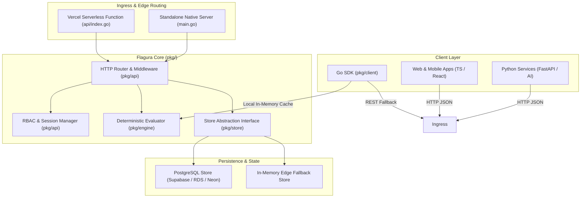
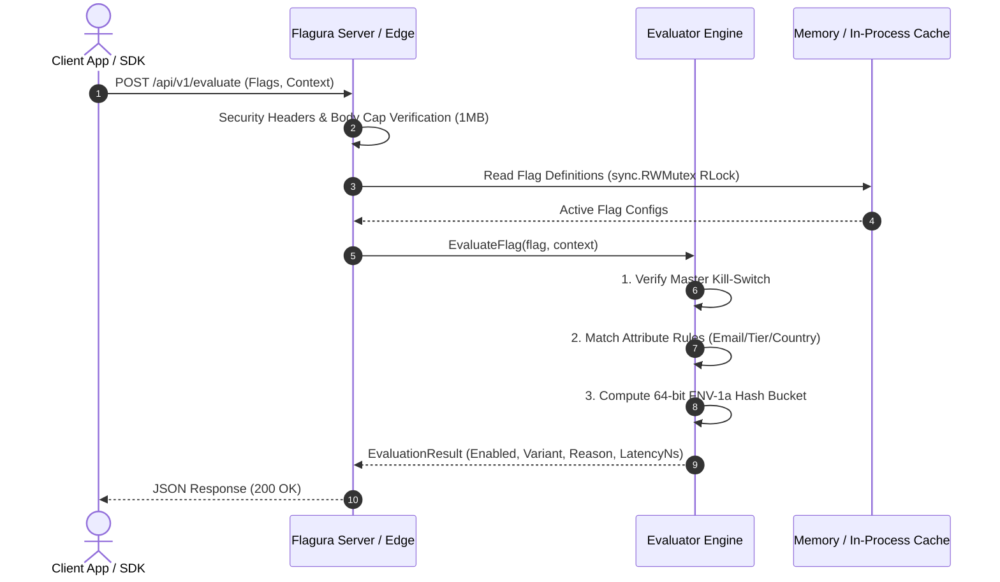
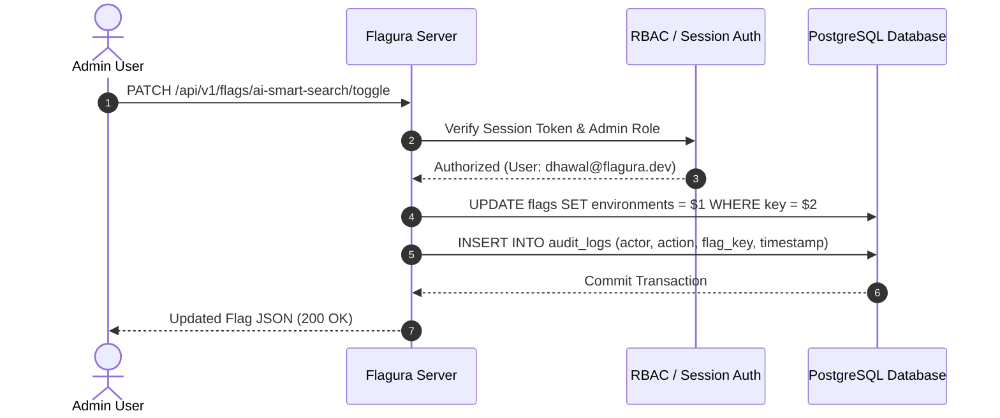

# 🏗️ System Architecture & Engineering Design

This document provides a comprehensive technical breakdown of Flagura's internals, component architecture, data flows, and design decisions for software engineers, systems architects, and SREs.

---

## 🏛️ High-Level System Architecture

---

## 🧩 Component Decomposition

| Component | Package Path | Architectural Responsibility |
| :--- | :--- | :--- |
| **Domain Models** | [`pkg/domain`](file:///Users/dhawal.dyavanpalli/go/src/flagura/pkg/domain) | Pure immutable domain structs (`FeatureFlag`, `TargetingRule`, `User`, `Session`, `AuditLog`). Zero third-party dependencies. |
| **Evaluation Engine** | [`pkg/engine`](file:///Users/dhawal.dyavanpalli/go/src/flagura/pkg/engine) | Pure mathematical rule evaluation and 64-bit FNV-1a sticky hashing. $O(1)$ time complexity with zero allocations on hot paths. |
| **Storage Abstraction** | [`pkg/store`](file:///Users/dhawal.dyavanpalli/go/src/flagura/pkg/store) | Pluggable persistence layer (`Store` interface) implementing `PostgresStore` (parameterized SQL) and thread-safe `MemoryStore`. |
| **API & Middleware** | [`pkg/api`](file:///Users/dhawal.dyavanpalli/go/src/flagura/pkg/api) | HTTP routing, RBAC enforcement, session cookie lifecycle, security headers, recovery middleware, and REST handlers. |
| **Compiled Web Views** | [`web/views`](file:///Users/dhawal.dyavanpalli/go/src/flagura/web/views) | Type-safe compiled HTML views via `templ` with zero runtime template parsing overhead. |
| **Official Go SDK** | [`pkg/client`](file:///Users/dhawal.dyavanpalli/go/src/flagura/pkg/client) | High-throughput client providing in-process background cache sync and sub-microsecond local evaluations. |

---

## 🔄 Core Data Flows

### 1. High-Performance Evaluation Request Flow

---

### 2. Flag Mutation & Audit Trail Flow

---

## ⚖️ Architectural Trade-Offs & Decisions

### 1. Compiled Templ Views vs. Client-Side SPA
- **Decision**: Compiled Go `templ` components with TailwindCSS and lightweight Alpine.js.
- **Rationale**: Eliminates complex Node.js build steps in production containers, reduces bundle size to < 60KB, achieves instant First Contentful Paint (FCP), and guarantees type-safety across Go data models and HTML.

### 2. Embedded Database Schema Migrations vs. Heavy ORMs
- **Decision**: Pure `database/sql` + parameterized prepared statements with idempotent auto-seeding.
- **Rationale**: Eliminates ORM reflection overhead, maximizes execution speed, and enables seamless compatibility across Supabase Transaction Poolers (port 6543), Neon, AWS RDS, and Local Postgres.

### 3. FNV-1a 64-bit Hashing vs. MD5 / SHA-256
- **Decision**: 64-bit Fowler–Noll–Vo (FNV-1a) non-cryptographic hashing for percentage rollouts.
- **Rationale**: Executes in **< 10 nanoseconds**, produces exceptional uniform bit distribution across 0–99 rollout buckets, and eliminates cryptographic hashing overhead on hot paths.
