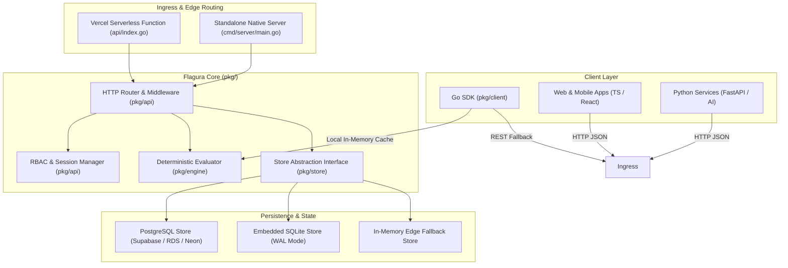
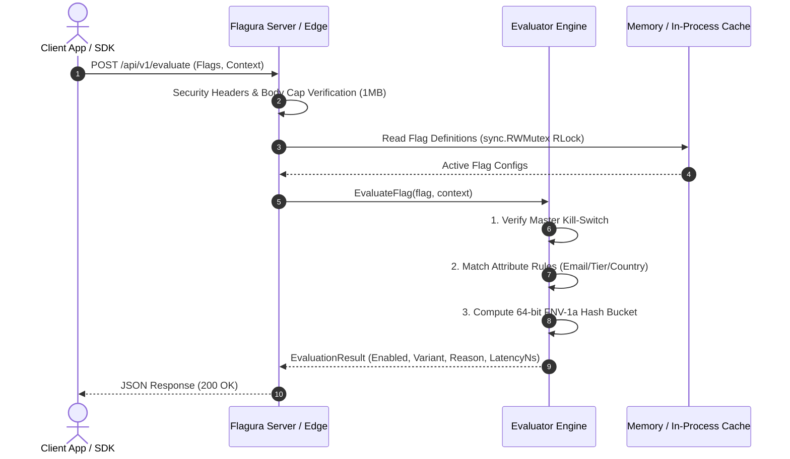
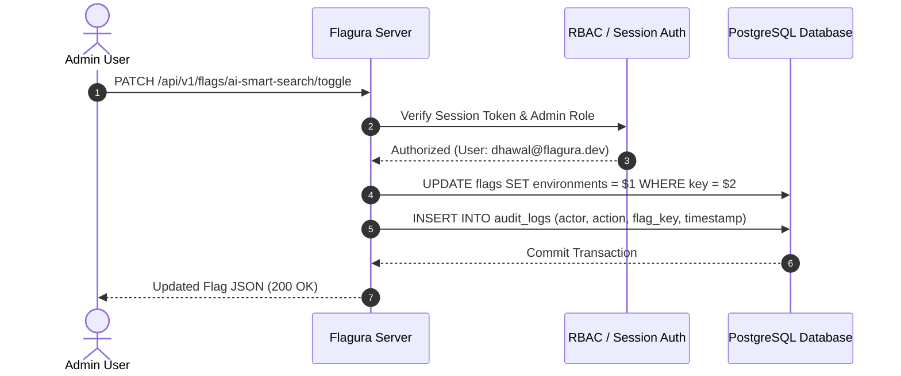

# 🏗️ System Architecture & Engineering Design

This document provides a comprehensive technical breakdown of Flagura's internals, component architecture, data flows, and design decisions for software engineers, systems architects, and SREs.

---

## 🏛️ High-Level System Architecture

---

## 🧩 Component Decomposition

| Component | Package Path | Architectural Responsibility |
| :--- | :--- | :--- |
| **Server Daemon** | [`cmd/server`](file:///Users/dhawal.dyavanpalli/go/src/flagura/cmd/server) | Production HTTP server entrypoint, configuration parsing, store auto-detection, and graceful shutdown lifecycle. |
| **Developer CLI** | [`cmd/cli`](file:///Users/dhawal.dyavanpalli/go/src/flagura/cmd/cli) | Single-binary terminal client for flag operations, 4-Eyes governance, API tokens, and static technical debt auditing. |
| **Domain Models** | [`pkg/domain`](file:///Users/dhawal.dyavanpalli/go/src/flagura/pkg/domain) | Pure immutable domain structs (`FeatureFlag`, `TargetingRule`, `User`, `Session`, `AuditLog`). Zero third-party dependencies. |
| **Evaluation Engine** | [`pkg/engine`](file:///Users/dhawal.dyavanpalli/go/src/flagura/pkg/engine) | Pure mathematical rule evaluation and 64-bit FNV-1a sticky hashing. $O(1)$ time complexity with zero allocations on hot paths. |
| **Storage Abstraction** | [`pkg/store`](file:///Users/dhawal.dyavanpalli/go/src/flagura/pkg/store) | Pluggable persistence layer (`Store` interface) implementing `PostgresStore` (Supabase/RDS), embedded `SQLiteStore` (WAL mode), and thread-safe `MemoryStore`. |
| **API & Middleware** | [`pkg/api`](file:///Users/dhawal.dyavanpalli/go/src/flagura/pkg/api) | HTTP routing, SSE streaming hub, RBAC enforcement, session auth, security headers, recovery middleware, and REST handlers. |
| **Compiled Web Views** | [`web/views`](file:///Users/dhawal.dyavanpalli/go/src/flagura/web/views) | Type-safe compiled HTML views via `templ` with zero runtime template parsing overhead. |
| **Official Go SDK** | [`pkg/client`](file:///Users/dhawal.dyavanpalli/go/src/flagura/pkg/client) & [`sdks/go`](file:///Users/dhawal.dyavanpalli/go/src/flagura/sdks/go) | High-throughput client providing in-process background cache sync and sub-microsecond local evaluations. |

---

## 🔄 Core Data Flows

### 1. High-Performance Evaluation Request Flow

---

### 2. Flag Mutation & Audit Trail Flow

---

## ⚖️ Architectural Trade-Offs & Decisions

### 1. Compiled Templ Views vs. Client-Side SPA
- **Decision**: Compiled Go `templ` components with TailwindCSS and lightweight Alpine.js.
- **Rationale**: Eliminates complex Node.js build steps in production containers, reduces bundle size to < 60KB, achieves instant First Contentful Paint (FCP), and guarantees type-safety across Go data models and HTML.

### 2. Embedded Database Schema Migrations vs. Heavy ORMs
- **Decision**: Pure `database/sql` + parameterized prepared statements with idempotent auto-seeding.
- **Rationale**: Eliminates ORM reflection overhead, maximizes execution speed, and enables seamless compatibility across Supabase Transaction Poolers (port 6543), Neon, AWS RDS, and Local Postgres.

### 3. FNV-1a 64-bit Hashing vs. MD5 / SHA-256
- **Decision**: 64-bit Fowler–Noll–Vo (FNV-1a) non-cryptographic hashing for percentage rollouts.
- **Rationale**: Executes in **< 10 nanoseconds**, produces exceptional uniform bit distribution across 0–99 rollout buckets, and eliminates cryptographic hashing overhead on hot paths.

---

## 📐 Core System Design Principles (Flagura v1.5.0)

Flagura's architecture follows strict microservice engineering principles:

### 1. Control Plane vs. Data Plane Separation
* **Data Plane (Hot Path)**: Flag evaluations happen **in-process** inside application SDKs in **~85ns**. Flags are evaluated in CPU cache against an in-memory synchronized mirror without executing network round-trips or database queries during user requests.
* **Control Plane (Management & Governance)**: The HTTP daemon (`cmd/server`) manages configurations, handles dual-approver (4-Eyes) change requests, captures immutable audit trails, and broadcasts configuration updates to connected SDKs via persistent HTTP/2 Server-Sent Events (SSE).

### 2. Standard Go Multi-Binary Project Layout (`golang-standards/project-layout`)
All executable entrypoints live strictly under `cmd/`:
* `cmd/server/`: The API server and web console daemon (`bin/flagura-server`).
* `cmd/cli/`: The developer CLI (`bin/flagura`), modularized into domain-specific files (`flags.go`, `audit.go`, `changerequests.go`, `apikeys.go`, `canary.go`, `client.go`, `main.go`).
* **Root Cleanliness**: No redundant `main.go` in the repository root.

### 3. The "Thin CLI / Rich Client" Principle
* The CLI tool (`cmd/cli`) does **not** directly import the database store (`pkg/store`) or run raw SQL queries.
* It communicates exclusively through the Control Plane HTTP API using Bearer tokens or API keys.
* **Why**: Guarantees that **RBAC permissions, audit logging, and change approval governance cannot be bypassed via terminal scripts**.

### 4. Dependency Inversion Principle (DIP)
* High-level routing and business logic modules depend exclusively on the abstract [`store.Store`](file:///Users/dhawal.dyavanpalli/go/src/flagura/pkg/store/store.go) interface.
* Concrete storage drivers (`PostgresStore`, embedded `SQLiteStore`, `MemoryStore`) are injected at runtime based on environment configuration (`DATABASE_URL`), enabling zero-downtime portability.

### 5. Zero-Trust Security & Zero PII Egress
* **Local Evaluation**: Contextual user attributes (email, tenant ID, country) are evaluated on the client host. Raw user identifiers never leave the host network.
* **Constant-Time Cryptography**: API key and session token verification uses `subtle.ConstantTimeCompare` to defend against timing side-channel attacks.
* **100% Parameterized SQL**: Zero SQL concatenation across PostgreSQL and SQLite database drivers.

### 6. Operational Resilience & Concurrency Safety
* **Graceful OS Signal Draining**: Intercepts `SIGINT` and `SIGTERM` with 5-second context timeouts to cleanly drain active SSE streams and HTTP connections.
* **SQLite WAL Mode**: Embedded SQLite operates with Write-Ahead Logging (`WAL`), `busy_timeout=5000ms`, and foreign keys enabled to prevent write locking bottlenecks.
* **Automated Guardrail Rollbacks**: Progressive canary deployments automatically revert to 0% rollout if error rate or P99 latency thresholds are violated.
