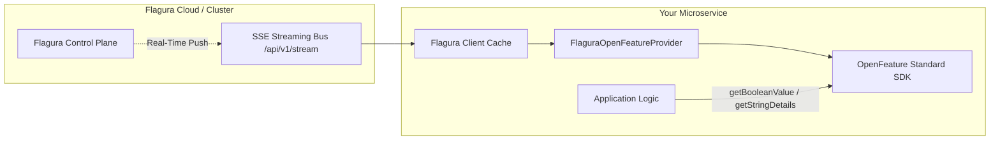

# 🌐 CNCF OpenFeature Integration Guide

Flagura provides first-class support for **[OpenFeature](https://openfeature.dev/)**, the Cloud Native Computing Foundation (CNCF) open standard for vendor-neutral feature flag evaluation.

With Flagura's OpenFeature providers, engineering teams get the best of both worlds:
1. **Sub-microsecond (<85ns) local evaluation** with real-time SSE streaming synchronization.
2. **Zero vendor lock-in** through universal OpenFeature APIs across Go, TypeScript/Node.js, and Python.

---

## 🏛️ Architecture Overview



- When your application calls OpenFeature evaluation APIs, the **Flagura Provider** resolves the flag instantly from in-memory cache using deterministic FNV-1a hashing.
- When an engineer toggles a flag or adjusts rollouts in the Flagura Console, the Control Plane pushes an update over SSE, emitting an OpenFeature `ProviderConfigChange` event into your application.

---

## 💻 Language Implementations

### 1. Go OpenFeature Provider

Install the SDKs:
```bash
go get github.com/dhawalhost/flagura/sdks/go
go get github.com/open-feature/go-sdk
```

Integration Code:
```go
package main

import (
	"context"
	"fmt"
	"log"

	flagura "github.com/dhawalhost/flagura/sdks/go"
	flaguraOF "github.com/dhawalhost/flagura/sdks/go/openfeature"
	of "github.com/open-feature/go-sdk/openfeature"
)

func main() {
	// 1. Initialize Flagura Client with in-process local evaluation
	client := flagura.NewClient("http://localhost:3000", "flg_live_your_api_key",
		flagura.WithLocalEvaluation(true),
	)
	defer client.Close()

	// 2. Set the global OpenFeature Provider
	provider := flaguraOF.NewProvider(client)
	if err := of.SetProvider(provider); err != nil {
		log.Fatalf("Failed to register OpenFeature provider: %v", err)
	}

	// 3. Create standard OpenFeature client
	ofClient := of.NewClient("checkout-service")

	// 4. Evaluate with standardized context
	evalCtx := of.NewEvaluationContext(
		"usr_alex_42",
		map[string]interface{}{
			"email":   "alex@company.com",
			"tier":    "pro",
			"country": "US",
		},
	)

	enabled, _ := ofClient.BooleanValue(context.Background(), "ai-smart-search", false, evalCtx)
	fmt.Printf("Flag 'ai-smart-search' active: %v\n", enabled)
}
```

---

### 2. TypeScript / Node.js OpenFeature Provider

Install the SDKs:
```bash
npm install @flagura/sdk @openfeature/server-sdk
```

Integration Code:
```typescript
import { FlaguraClient } from '@flagura/sdk';
import { FlaguraOpenFeatureProvider } from '@flagura/sdk/openfeature';
import { OpenFeature } from '@openfeature/server-sdk';

async function initFlags() {
  // 1. Initialize Flagura Client
  const client = new FlaguraClient({
    endpoint: 'http://localhost:3000',
    apiKey: 'flg_live_your_api_key',
    defaultEnvironment: 'production',
  });

  // 2. Register OpenFeature Provider
  const provider = new FlaguraOpenFeatureProvider(client);
  await OpenFeature.setProviderAndWait(provider);

  // 3. Obtain OpenFeature Client
  const ofClient = OpenFeature.getClient('billing-service');

  // 4. Evaluate
  const context = {
    targetingKey: 'usr_sarah_99',
    email: 'sarah@company.com',
    tier: 'enterprise',
  };

  const isEnabled = await ofClient.getBooleanValue('ai-smart-search', false, context);
  console.log(`OpenFeature evaluated: ${isEnabled}`);
}

initFlags();
```

---

### 3. Python OpenFeature Provider

Install the SDKs:
```bash
pip install flagura openfeature-sdk
```

Integration Code:
```python
from openfeature import api
from openfeature.evaluation_context import EvaluationContext
from flagura import FlaguraClient
from flagura.openfeature_provider import FlaguraOpenFeatureProvider

# 1. Initialize client and provider
client = FlaguraClient(
    endpoint="http://localhost:3000",
    api_key="flg_live_your_api_key",
    default_environment="production",
)
provider = FlaguraOpenFeatureProvider(client=client)

# 2. Register OpenFeature provider
api.set_provider(provider)
of_client = api.get_client("catalog-service")

# 3. Evaluate with standardized EvaluationContext
context = EvaluationContext(
    targeting_key="usr_david_07",
    attributes={
        "email": "david@company.com",
        "tier": "pro",
    }
)

is_active = of_client.get_boolean_value("ai-smart-search", False, context)
print(f"OpenFeature flag state: {is_active}")

client.close()
```

---

## 🗺️ Resolution & Reason Mapping

Flagura maps internal evaluation reasons directly to OpenFeature resolution codes:

| Flagura Strategy / Reason | OpenFeature Reason Code | Meaning |
| :--- | :--- | :--- |
| `STRATEGY_BOOLEAN` | `STATIC` | Flag has a static ON/OFF state without conditions |
| `TARGETING_RULE_MATCH` | `TARGETING_MATCH` | Context matched specific user/company rule |
| `STRATEGY_PERCENTAGE` | `SPLIT` | Context hashed into a percentage rollout cohort |
| `ENV_DISABLED` / `KILL_SWITCH` | `DISABLED` | Environment toggle or instant kill-switch active |
| `FLAG_NOT_FOUND` | `DEFAULT` | Flag key does not exist; default fallback returned |

---

## ⚡ Real-Time SSE Bus Integration

All Flagura OpenFeature providers bind to the underlying SSE stream:
- When a flag is modified, a `ProviderConfigChange` event is fired containing the slice of `changedKeys`.
- OpenFeature hooks and event listeners can subscribe to these events for cache invalidation or telemetry logging:

```go
// Go Event Hook Listener
provider.EventChannel() // receives of.Event{EventType: of.ProviderConfigChange}
```
