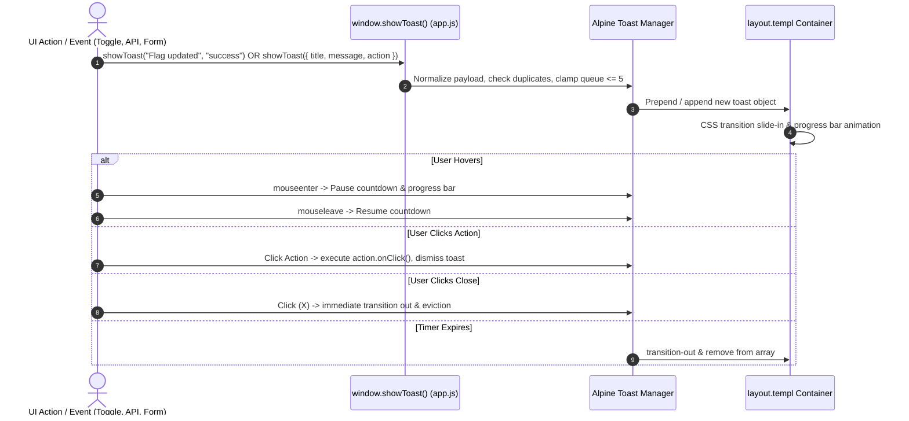

# Technical Implementation Plan: Modern Interactive Toast Notifications System

**Feature Slug**: `009-ui-toast-notifications`  
**Spec**: `specs/009-ui-toast-notifications/spec.md`  
**Status**: Completed  
**Created**: 2026-09-23  

---

## 1. Architectural Architecture



---

## 2. Component Design & Contracts

### 2.1 Toast Object Schema
```javascript
{
  id: "t_179014...",
  title: "Flag Updated",            // Optional bold title
  message: "ai-search enabled in prod", // Primary message text
  type: "success",                  // 'success' | 'error' | 'warning' | 'info' | 'copied'
  duration: 4000,                   // Total duration in ms (0 for persistent)
  remaining: 4000,                  // Remaining duration
  paused: false,                    // Paused on mouseenter
  createdAt: 17901423...,
  action: {                         // Optional interactive action
    label: "Undo",
    onClick: () => {}
  }
}
```

### 2.2 Visual Styles & Color Schemes
| Type | Container Style | Icon SVG | Progress Bar |
|:---|:---|:---|:---|
| **`success`** | `bg-white/95 border-emerald-200/80 text-emerald-950 shadow-emerald-500/5` | Emerald Check Circle | `bg-emerald-500` |
| **`error`** | `bg-white/95 border-rose-200/80 text-rose-950 shadow-rose-500/5` | Rose Alert Circle | `bg-rose-500` |
| **`warning`** | `bg-white/95 border-amber-200/80 text-amber-950 shadow-amber-500/5` | Amber Alert Triangle | `bg-amber-500` |
| **`info`** | `bg-white/95 border-indigo-200/80 text-indigo-950 shadow-indigo-500/5` | Indigo Info Circle | `bg-indigo-500` |
| **`copied`** | `bg-slate-900/95 border-slate-800 text-slate-100 shadow-slate-950/20` | Sky Clipboard Check | `bg-sky-400` |

---

## 3. Implementation Plan

### Step 1: Layout & Template (`web/views/layout.templ`)
- Redesign `#toast-container` with modern responsive positioning (`fixed bottom-5 right-5 sm:bottom-6 sm:right-6 z-50 flex flex-col gap-2.5 max-w-sm sm:max-w-md w-full pointer-events-none`).
- Provide clean, inline SVGs for all 5 toast types plus the close button (`×`).
- Include support for optional `toast.title` and `toast.action`.
- Add an animated countdown indicator using CSS or inline style percentage.

### Step 2: Toast Engine & Alpine.js (`web/static/js/app.js`)
- Upgrade `globalToastHandler` and `showToast()` to accept both string and object signatures.
- Implement ticker/timeout management with pause and resume handlers.
- Add duplicate suppression within a 1,000ms window.
- Add stack management (cap at 5 items).

### Step 3: Backward Compatibility Verification
- Verify all existing calls to `showToast(...)` across `app.js` (flags, env switch, benchmarks, evaluator, auth, projects, API keys).
- Add example action toasts (e.g. on flag toggle: "Flag toggled" with "Undo" action).

### Step 4: Quality & Templ Verification
- Recompile Templ templates with `templ generate`.
- Run `go test -v ./pkg/api` to verify UI component tests.
- Run `go test -race ./...` and `gosec -exclude-dir=web/views ./...`.
